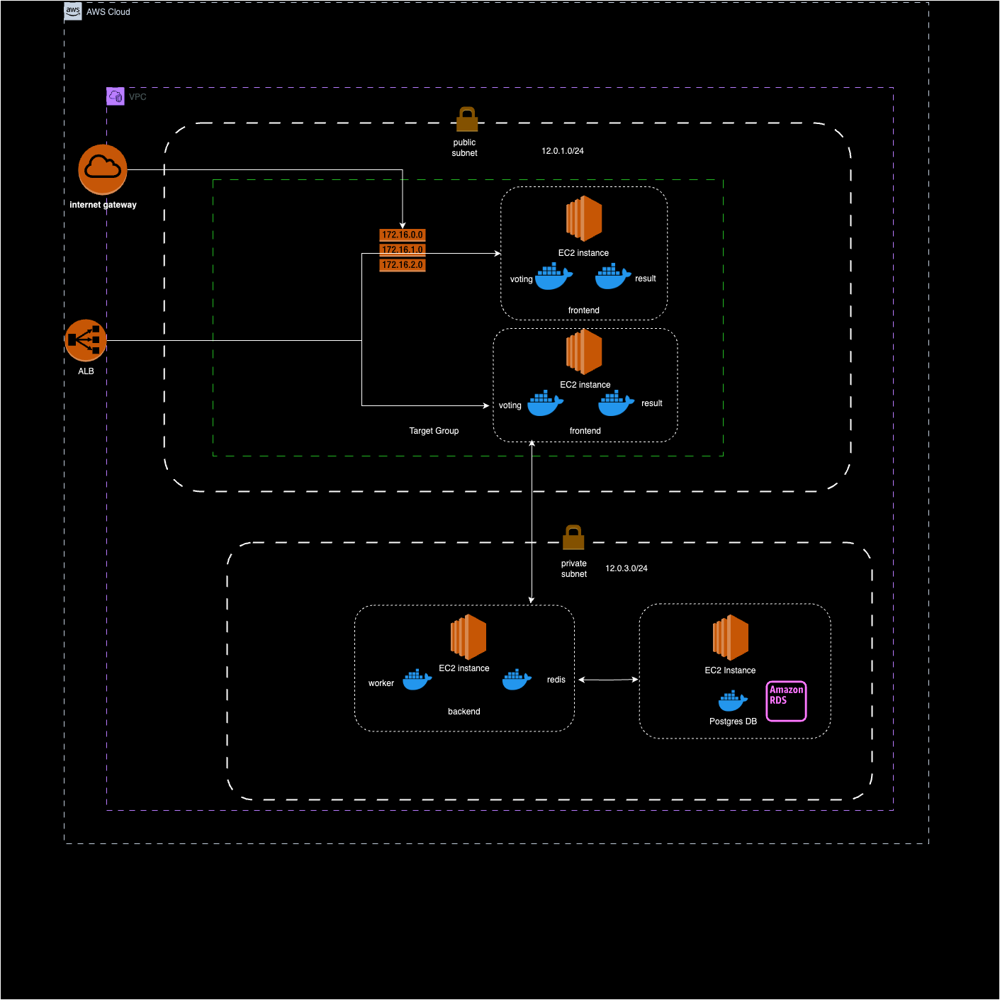

# ewc-challenge

## Scenario 1 - Development Set-Up for Example Voting App

### Discuss & Justify Potential Deployment Options in Terms of Infrastructure for Development Environment:

Application Overview:
The example voting app consists of multiple components:

+ Voting App: A front-end application that allows users to vote.
+ Result App: A front-end application that displays the voting results.
+ Worker: A background service that processes votes.
+ Redis: A key-value store used by the voting app and worker.
+ PostgreSQL: A relational database used by the result app to store voting results

### Deployment Options in terms if infrastructure for Development Environment:

I think we have multiple options for deployment of our **DEV** environment (consider AWS as our preferred cloud): 

### (Option 1) Deploy the containerized voting application on DEV VMs (EC2 instances):

Using this approach we can leverage a cloud ( AWS ) in the most simplest way to spin up a DEV environment. This approach ensures a scalable and consistent development environment using AWS EC2 instances and Docker containers. It mirrors the production environment closely, facilitating smooth transitions from development to production:

> **Note**: It is best that the following resources are provisioned in AWS using **Infrastructure-as-code** where we can leverage **Terraform or AWS cloudformation** , making it reproducable and manageable.
It involves:
1. **Creating a VPC**
    + Setting up public subnet ((for frontend apps (voting and result) that needs to be exposed to the public internet) and private subnet (for backend services (worker and redis) and DB))
    + Setting up internet gateway and attaching it to the VPC
    + Creating routing tables and configuring them to route traffic through the internet gateway
2.  **Launching Ec2 instances**
    + Choosing appropriate OS and its distribution (Linux / Ubuntu for example)
    + Choosing appropriate ec2 instance type (depending on the hardware requirements)
    + Choosing OS disk size and provision data disks (in order to persist the DB data)
    + Assigning VPC and the subnet to the ec2 instance
    + Configure security groups 
        + In order to allow SSH and HTTP access to the ec2 instances and open all necessary ports.
        + To make the ec2 instances accessible via public internet or only by certain instances within the VPC only
3. **Configuring EC2 instance**
    + Check access to ec2 instances by SSH into each instance
    + Creating disk partitions and mounting to Filesystems
    +  Install docker and docker compose (This can be also done by leveraging AWS User Data in terraform or AWS Cloudformation)

4. **Deploy the Application**
    The repo mentioned in this assignment already have a docker-compose.yaml script prepared to deploy all application. However we would need to adapt the script to match our desired setup, if needed. The default configuration should work, but ensure that the port are correctly mapped, volumes are mounted correctly (specially DB data volumes) and services are defined properly.

#### Approach for deploying the application across multiple EC2 instances
In my opinion we can group frontend, backend and DB in separate ec2 instances. For eample frontend (voting and result) apps on once instance, backend services on another, and the DB on a third instance. In this way we would have 3 ec2 instances deployed in total.

The advantages of deploying in this approach are:

+ **Balance:** Provides a balance between resource sharing and isolation.
+ **Scalability:** Easier to scale groups of services rather than individual services.
+ **Cost-Effective:** More cost-effective than deploying each service on a separate instance.

When using the approach mentioned above, considering that it is a voting application, we would also need a application load balancer (AWS) in order to distribute incoming traffic among the frontend instances. A network load balancer (AWS) can also be ideally setup in order to distribute traffic amount multiple backend instances. Setting up an ALB and NLB would ensure the following: 

+ high availability, scalability, and fault tolerance for our frontend application
+ We can stress and load test our application in the **DEV** environment
+ Distribute traffic among multiple backend instances
+ Allow the frontend to communicate with a single endpoint, which is the network load balancer.

Since we want to only run a single instance of the DB, load balancing is not required here. 

#### Database Persistence

The final steps could be to think about persisting our DB for the voting application and leverage Amazon RDS in order to have automated backup and restore of our DB. We can also create snapshots of our DB at any time. But i think for our **DEV** environment setup we can use a much more cost effective solution which is to automate DB backups using `pg_dump` (since our app uses PostgresQL) and store them in Amazon S3 buckets. Ideally a cron job could be used to run a back up scrip at regular intervals or can be automated in our CI / CD pipeline that we will setup. Alternatively, for our **DEV** setup, we can also persist data on the filesystem by using externally attached data disks to our EC2 instances.

#### Continous deployment with docker and CI/CD

One thing I forgot to mention is how to handle service updates, docker images and manage version in our docker compose setup.

 When a service is updated, the corresponding Docker image needs to be rebuilt and pushed to a Docker registry. We can leverage Amazon ECR as our container registry. 
1. **Update docker images**:
    + Build and push the new docker images
2. Update the docker compose file
    + update the image tags in the docker compose file to a new version 
3. Deploy the update services
    + Pull the lates images and restart the services. 

This process can also be updated by setting up a CI / CD Pipeline for this (e.g. Gitlab CI / CD or Github Actions) to automate the build, push, and deployment process.

By taking care we can make sure that our services are always up to date with the latest code and docker images, and the deployment process is streamlined and automated.

#### Autoscaling Groups:

We can use Auto Scaling Groups, to enhance the approach mentioned above, in order to manage a group of EC2 instances and automatically scale the number of instances based on demand / load.

For this purpose we would need to setup two Auto scaling groups:

+ **Frontend Auto scaling group:** Hosts multiple EC2 instances running the voting and result applications.
+ **Backend Auto scaling group:** Hosts multiple EC2 instances running the worker and Redis services.

Please find below the Architecture diagram of the DEV infra deployment approach discussed above:

> **Note**: Code and Implementation for the approach mentioned above can be found in this repository. 

### (Option 2) Deploy the voting application DEV environment using AWS Elastic Container Service:

For this approach: 
+ Create an ECS Cluster that includes the EC2 instances. 
+ The EC2 instances will be launched independently and will join the ECS cluster and run the container tasks. 
+ Define ECS task definitions for each component of the application (Voting App, Result App, Worker, Redis, PostgreSQL).

Deploying an application using AWS ECS with EC2, for development environment, offers several advantages over simply running Docker containers on plain EC2 instances. Some key advantages are:

+ Management and Orchestration:
    + AWS ECS provides a managed service that takes care of container orchestration and automatically handles container placement, scaling and scheduling where is using Option 1 requires to manage these tasks manually
    + ECS ensures to automatically restart failed containers and deploying any additional instances based on load of the application.
+ Automated scaling
    + ECS supports automatic scaling of both the container instances and the services running on those instances
    + ECS automatically places container tasks on the best fit instances according to our specified requirements
+  Environment separation:
    + ECS makes it easier to manage multiple environments (development, staging, production) by logically grouping and isolating our services and resources. This is more challenging to implement and maintain in option 1
+ Monitoring and logging
    + In option 1 we have to install and manage the monitoring and logging tools manually. However ECS can be integrated easily with services like AWS Cloudwatch which automatically collects and aggregrates logs and metrics.

### (Option 3) Deploy the voting application on a DEV cluster (kubernetes EKS)

Since we would want to consider high availability and scalability for the voting application, spinning up a k8s dev cluster is also a very good option.

+ EKS provides the same Kubernetes environment in both development and production, ensuring consistency. This means that what works in development is highly likely to work in production without unexpected issues.
+ EKS allows you to easily scale your Kubernetes cluster up or down based on our development needs.
+ k8s supports rolling updates and quick rollbacks, making it easy to test new code versions in a development environment with minimal downtime and risk.
+ We can also leverage Helm, write helm charts for templating all our k8s deployments / resources. We can easily separate and manage dev and prod environments by creating two different values files for dev and prod. 

> **Note**: Code and Implementation for option 1 can be found in this repository. 
